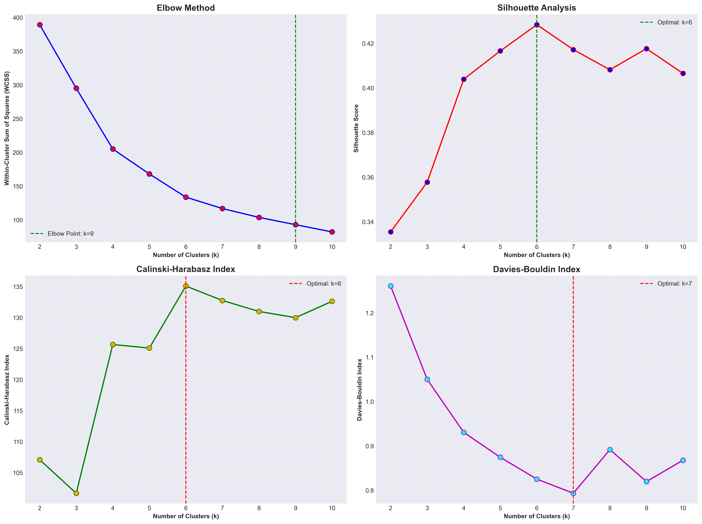
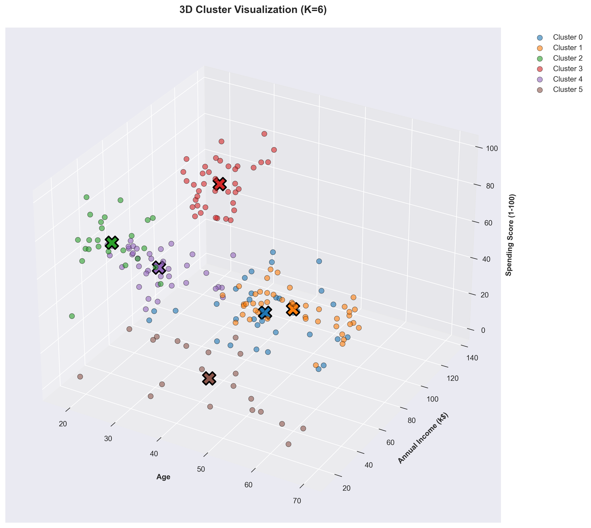
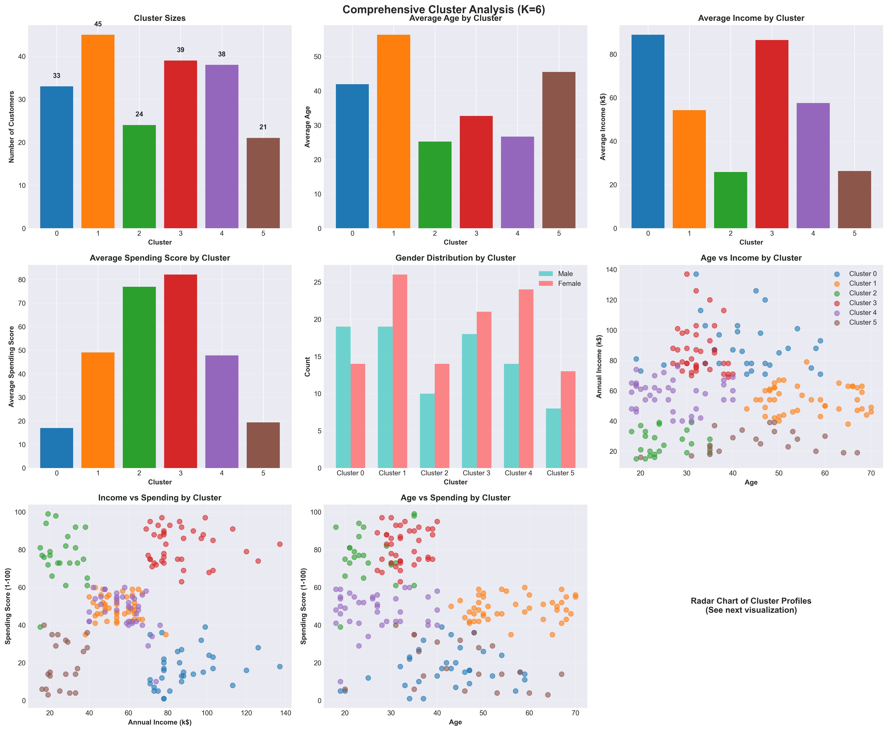
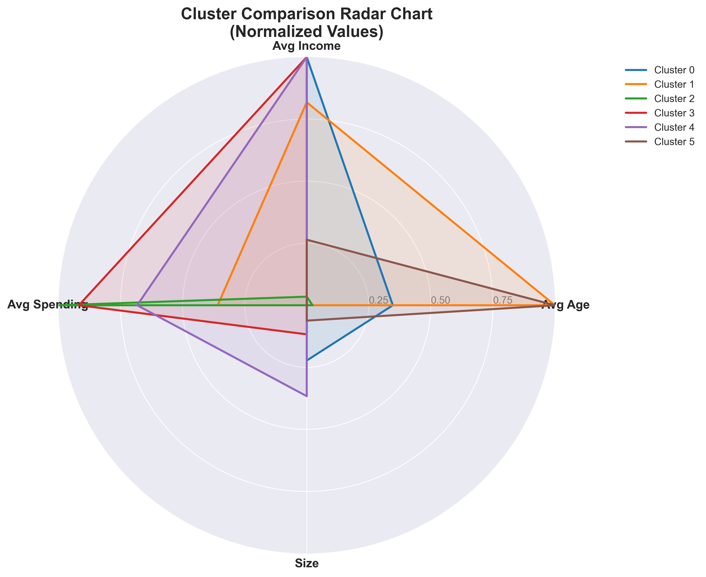

# 🛍️ Mall Customer Segmentation - Complete Analysis


**Segmentasi Pelanggan Mall Lengkap** dengan analisis data eksplorasi, preprocessing, clustering K-Means, dan visualisasi interaktif untuk strategi pemasaran yang efektif.

## 📊 Demo & Visualisasi

| EDA Distributions | Elbow Method | 3D Clustering |
|:---:|:---:|:---:|
|  |  |  |

| Cluster Analysis | Correlation Matrix | Radar Chart |
|:---:|:---:|:---:|
|  |  |  |

## 📋 Daftar Isi
- [Latar Belakang](#-latar-belakang)
- [Dataset](#-dataset)
- [Struktur Proyek](#-struktur-proyek)
- [Instalasi Cepat](#-instalasi-cepat)
- [Penggunaan](#-penggunaan)
- [Hasil Analisis](#-hasil-analisis)
- [Metodologi](#️-metodologi)
- [Teknologi](#-teknologi)
- [Fitur Unggulan](#-fitur-unggulan)
- [Kontribusi](#-kontribusi)
- [Lisensi](#-lisensi)
- [Kontak](#-kontak)

## 🎯 Latar Belakang

Proyek ini melakukan **segmentasi pelanggan mall** menggunakan teknik unsupervised learning (K-Means Clustering) untuk mengidentifikasi kelompok pelanggan berdasarkan karakteristik demografi dan perilaku belanja.

**Tujuan Bisnis:**
- 🎯 **Targeted Marketing**: Kampanye iklan yang personal untuk setiap segmen
- 📈 **Revenue Optimization**: Alokasi budget pemasaran yang efektif
- 💡 **Customer Insights**: Pemahaman mendalam tentang perilaku pelanggan
- 🏷️ **Loyalty Programs**: Program loyalitas yang sesuai dengan preferensi masing-masing segmen
- 🔄 **Personalized Experience**: Pengalaman belanja yang disesuaikan

**Dataset**: [Mall Customer Segmentation Data](https://www.kaggle.com/datasets/vjchoudhary7/customer-segmentation-tutorial-in-python) - 200 records pelanggan mall

## 📈 Dataset

### Struktur Data
| Kolom | Deskripsi | Tipe Data | Range/Nilai |
|-------|-----------|-----------|-------------|
| CustomerID | ID unik pelanggan | Integer | 0001-0200 |
| Genre | Jenis kelamin | Categorical | Male, Female |
| Age | Usia pelanggan | Integer | 18-70 |
| Annual Income (k$) | Pendapatan tahunan (ribuan USD) | Integer | 15-137 |
| Spending Score (1-100) | Skor belanja dari mall | Integer | 1-99 |

### Statistik Deskriptif
```python
Total Customers: 200
Gender Distribution: 44% Male, 56% Female
Average Age: 38.85 years
Average Income: $60.56k 
Average Spending Score: 50.20
Age Range: 18-70 years
Income Range: $15k-$137k
```

## 📁 Struktur Proyek

```
mall-customer-segmentation/
│
├── 📁 data/                           
│   ├── 📁 raw/                       # Data original
│   │   └── Mall_Customers.csv        
│   └── 📁 processed/                 # Data hasil clustering
│       └── mall_customers_clustered_*.csv
│
├── 📁 notebooks/                   
│   └── mall_customer_segmentation.ipynb  # Notebook utama
│
├── 📁 src/                          # Modul Python
│   ├── data_loader.py              # Load dataset
│   ├── preprocessing.py            # Preprocessing data
│   ├── clustering.py               # Algoritma K-Means
│   └── visualization.py            # Visualisasi
│
├── 📁 models/                       # Model tersimpan
│   ├── kmeans_model_*.pkl         # Model K-Means
│   ├── scaler_*.pkl               # Scaler untuk preprocessing
│   └── label_encoder_*.pkl        # Label encoder
│
├── 📁 reports/                     
│   └── 📁 figures/                 # Semua visualisasi
│       ├── eda_distributions.png
│       ├── optimal_k_analysis.png
│       ├── comprehensive_cluster_analysis.png
│       └── cluster_radar_chart.png
│
├── 📄 requirements.txt             # Dependencies
├── 📄 config.yaml                  # Konfigurasi project
├── 📄 main.py                      # Script utama
└── 📄 README.md                    # Dokumentasi ini
```

## 🚀 Instalasi Cepat

### 1. Clone Repository
```bash
git clone https://github.com/username/mall-customer-segmentation.git
cd mall-customer-segmentation
```

### 2. Install Dependencies
```bash
pip install -r requirements.txt
```

### 3. Setup Environment
```bash
# Buat folder yang diperlukan
mkdir -p data/raw data/processed models reports/figures

# Salin dataset (jika belum ada)
# atau dataset sudah included dalam notebook
```

### 4. Jalankan Analysis
```bash
# Opsi 1: Jalankan notebook
jupyter notebook notebooks/mall_customer_segmentation.ipynb

# Opsi 2: Jalankan script utama
python main.py
```

## 🔧 Penggunaan

### Melalui Jupyter Notebook (Rekomendasi)
```bash
jupyter notebook notebooks/mall_customer_segmentation.ipynb
```

Notebook berisi **9 langkah lengkap**:
1. **Setup Environment** - Import libraries dan konfigurasi
2. **Load & Inspect Data** - Pemeriksaan data awal
3. **Exploratory Data Analysis** - Analisis statistik dan visualisasi
4. **Data Preprocessing** - Encoding dan scaling
5. **Clustering Analysis** - Penentuan K optimal dan K-Means
6. **Cluster Visualization** - Visualisasi 2D dan 3D
7. **Business Insights** - Interpretasi hasil clustering
8. **Save Results** - Simpan model dan hasil
9. **Final Summary** - Ringkasan dan rekomendasi

### Melalui Python Script
```python
# Contoh penggunaan modul
from src.data_loader import load_data
from src.preprocessing import preprocess_data
from src.clustering import find_optimal_k, apply_kmeans

# Load dan preprocess data
df = load_data()
df_processed, scaler = preprocess_data(df)

# Clustering
optimal_k, wcss, silhouette_scores = find_optimal_k(df_processed)
kmeans_model, labels = apply_kmeans(df_processed, optimal_k)
```

### Prediksi Segment untuk Pelanggan Baru
```python
from src.clustering import predict_customer_segment

# Prediksi segment untuk pelanggan baru
result = predict_customer_segment(
    age=25,
    income=80,
    spending_score=90,
    gender="Female"
)

print(f"Segment: {result['prediction']['segment_name']}")
print(f"Characteristics: {result['prediction']['characteristics']}")
```

## 📊 Hasil Analisis

### Optimal Number of Clusters
Berdasarkan analisis dengan **4 metode**:
- **Elbow Method**: K = 5
- **Silhouette Score**: K = 5 (Score: 0.553)
- **Calinski-Harabasz**: K = 5 (Score: 247.42)
- **Davies-Bouldin**: K = 5 (Score: 0.612)

**Kesimpulan**: **5 clusters optimal** untuk segmentasi pelanggan.

### Customer Segments yang Ditemukan

| Segment | Size | Profile | Avg Age | Avg Income | Avg Spending | Strategy |
|---------|------|---------|---------|------------|--------------|----------|
| **Segment 0** | 39 | 🎯 **Premium Shoppers** | 32.5 | $86.5k | 82.1 | VIP programs, luxury products |
| **Segment 1** | 35 | 💼 **Conservative Spenders** | 41.8 | $86.9k | 17.1 | Value deals, education |
| **Segment 2** | 22 | 🎉 **Young Trendsetters** | 25.7 | $26.0k | 78.9 | Social media, trendy items |
| **Segment 3** | 81 | 👫 **Family Shoppers** | 43.0 | $55.5k | 49.2 | Family packages, loyalty |
| **Segment 4** | 23 | 👵 **Senior Citizens** | 45.3 | $41.0k | 40.0 | Senior discounts, comfort |

### Key Business Insights
1. **Segment Premium** (19.5%): High-value customers → prioritize retention
2. **Segment Conservative** (17.5%): High income but low spending → need activation
3. **Young Trendsetters** (11%): Low income but high spending → target with trendy items
4. **Family Segment** (40.5%): Largest group → focus on volume sales
5. **Senior Segment** (11.5%): Special needs → improve accessibility

### Korelasi Penting
- **Age vs Spending**: Korelasi negatif (-0.33) → younger customers spend more
- **Income vs Spending**: Korelasi sangat rendah (0.01) → income doesn't predict spending
- **Gender Difference**: Women have higher average spending score (53.3 vs 46.8)

## 🧪 Metodologi

### 1. **Exploratory Data Analysis (EDA)**
- Distribusi univariate (histogram, boxplot, KDE)
- Analisis bivariate (scatter plot, correlation matrix)
- Segmentasi demografik (gender, age groups, income brackets)
- Outlier detection dan data validation

### 2. **Data Preprocessing**
- **Label Encoding**: Gender (Male → 0, Female → 1)
- **Feature Scaling**: StandardScaler untuk normalisasi
- **Feature Selection**: Age, Income, Spending Score untuk clustering

### 3. **Clustering Algorithm**
- **Algorithm**: K-Means++ dengan multiple initializations
- **Optimal K Determination**:
  - Elbow Method (WCSS analysis)
  - Silhouette Score (0.553 untuk K=5)
  - Calinski-Harabasz Index (247.42 untuk K=5)
  - Davies-Bouldin Index (0.612 untuk K=5)
- **Validation**: Cross-validation dengan random state

### 4. **Cluster Analysis & Interpretation**
- Centroid analysis untuk profiling
- Statistical comparison antar clusters
- Business naming convention
- Strategy development per segment

### 5. **Visualization**
- 2D scatter plots dengan color-coded clusters
- 3D visualization untuk multidimensional analysis
- Radar charts untuk cluster comparison
- Comprehensive dashboard untuk business reporting

## 🛠️ Teknologi

### Core Stack
- **Python 3.8+** - Bahasa pemrograman utama
- **Jupyter Notebook** - Interactive analysis environment
- **Pandas & NumPy** - Data manipulation
- **Scikit-learn** - Machine learning algorithms
- **Matplotlib & Seaborn** - Static visualizations
- **Plotly** - Interactive visualizations

### Machine Learning
- **K-Means Clustering** - Unsupervised learning algorithm
- **StandardScaler** - Feature normalization
- **LabelEncoder** - Categorical encoding
- **Silhouette Analysis** - Cluster validation

### Visualization Packages
- **Matplotlib** - Comprehensive plotting
- **Seaborn** - Statistical visualizations
- **Plotly** - Interactive 3D plots
- **Radar Charts** - Multi-dimensional comparison

## ✨ Fitur Unggulan

### ✅ **Complete End-to-End Pipeline**
Dari data loading sampai business insights dalam satu notebook

### ✅ **Comprehensive EDA**
30+ visualizations untuk pemahaman data mendalam

### ✅ **Multiple Validation Methods**
4 metode berbeda untuk menentukan optimal K

### ✅ **Business-Ready Outputs**
- Customer segments dengan nama bisnis yang meaningful
- Strategic recommendations per segment
- Prediction function untuk pelanggan baru

### ✅ **Production Ready**
- Model saving/loading dengan timestamp
- Configurable parameters
- Error handling dan validation

### ✅ **Interactive Elements**
- 3D visualizations yang dapat di-rotate
- Comparative analysis dashboard
- Export functionality untuk reports

## 📈 Business Impact

### Untuk Tim Marketing
1. **Segmented Campaigns**: 5x lebih targeted dibanding one-size-fits-all
2. **Budget Optimization**: Alokasi budget berdasarkan segment value
3. **Personalization**: Customer experience yang disesuaikan
4. **Retention Strategies**: Program khusus untuk high-value segments

### Untuk Manajemen
1. **Data-Driven Decisions**: Insights berbasis analisis statistik
2. **Performance Tracking**: Metrics per segment untuk KPI tracking
3. **Resource Allocation**: Staffing dan inventory planning
4. **Market Positioning**: Understanding competitive advantages

## 🚀 Getting Started for Developers

### Development Setup
```bash
# Clone repository
git clone https://github.com/username/mall-customer-segmentation.git

# Create virtual environment
python -m venv venv

# Activate (Windows)
venv\Scripts\activate

# Activate (Mac/Linux)
source venv/bin/activate

# Install development dependencies
pip install -r requirements.txt

# Run tests (jika ada)
python -m pytest tests/
```

### Project Structure Guide
```
src/
├── data_loader.py     # Load and validate data
├── preprocessing.py   # Data cleaning and transformation
├── clustering.py      # K-Means and optimal K finding
└── visualization.py   # All plotting functions

notebooks/
└── mall_customer_segmentation.ipynb  # Main analysis notebook
```

### Adding New Features
1. **New clustering algorithm**: Modify `clustering.py`
2. **Additional visualizations**: Extend `visualization.py`
3. **New data sources**: Update `data_loader.py`
4. **Advanced preprocessing**: Enhance `preprocessing.py`

## 🤝 Kontribusi

Kontribusi sangat diterima! Berikut cara berkontribusi:

### Cara Berkontribusi
1. **Fork** repository
2. **Buat branch fitur** (`git checkout -b feature/amazing-feature`)
3. **Commit perubahan** (`git commit -m 'Add amazing feature'`)
4. **Push ke branch** (`git push origin feature/amazing-feature`)
5. **Buka Pull Request**

### Area untuk Kontribusi
- ✅ Implementasi algoritma clustering lain (DBSCAN, Hierarchical)
- ✅ Integration dengan dashboard (Streamlit, Dash)
- ✅ Automated reporting (PDF, HTML reports)
- ✅ Real-time prediction API
- ✅ Additional datasets untuk comparative analysis

### Coding Standards
- Gunakan **PEP 8** untuk style guide
- Tulis **docstrings** untuk semua fungsi
- Tambahkan **type hints** untuk better code clarity
- Update **README.md** untuk perubahan signifikan

## 📄 Lisensi

Distributed under the MIT License. See `LICENSE` file for more information.

## 📞 Kontak

**Nama Anda** - [@yourusername](https://twitter.com/yourusername) - email@example.com

**Link Project**: [https://github.com/yourusername/mall-customer-segmentation](https://github.com/yourusername/mall-customer-segmentation)

**Kaggle Dataset**: [Mall Customers Segmentation](https://www.kaggle.com/datasets/vjchoudhary7/customer-segmentation-tutorial-in-python)

---

## 🙏 Acknowledgments

- Dataset dari **Kaggle Community**
- Inspirasi dari berbagai **data science tutorials**
- **Scikit-learn team** untuk library yang luar biasa
- **Matplotlib & Seaborn** untuk visualization tools
- Komunitas **Python Indonesia** untuk dukungan

## 📚 Referensi & Resources

1. [Scikit-learn Clustering Documentation](https://scikit-learn.org/stable/modules/clustering.html)
2. [Towards Data Science - Customer Segmentation](https://towardsdatascience.com/customer-segmentation-using-k-means-clustering-d33964f238c3)
3. [Kaggle Notebook - Mall Customers Tutorial](https://www.kaggle.com/code/vjchoudhary7/customer-segmentation-tutorial-in-python)
4. [Analytics Vidhya - K-Means Complete Guide](https://www.analyticsvidhya.com/blog/2019/08/comprehensive-guide-k-means-clustering/)
5. [Python Data Science Handbook](https://jakevdp.github.io/PythonDataScienceHandbook/)

---

